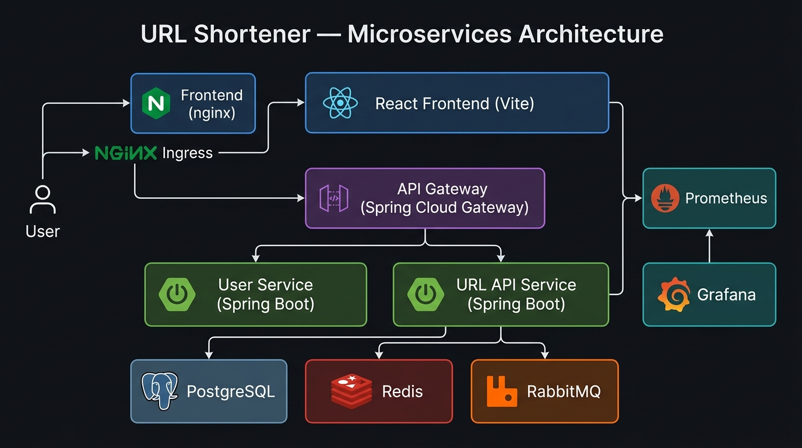

# 🔗 URL Shortener

A production-ready, cloud-native URL shortener built on a **microservices architecture** using Spring Boot, React, and Kubernetes.



## ✨ Features

- 🔐 **JWT Authentication** — Secure registration & login via a dedicated User Service
- ✂️ **URL Shortening** — Generate short codes with click-tracking and analytics
- ⚡ **Redis Caching** — Sub-millisecond redirect lookups (TTL configurable)
- 📨 **Async Events** — RabbitMQ messaging for decoupled click-count updates
- 📊 **Observability** — Prometheus metrics + Grafana dashboards out of the box
- 🐳 **Docker Compose** — One-command local dev environment
- ☸️ **Kubernetes (kind)** — Local k8s cluster with NGINX Ingress via a single PowerShell script
- ⚙️ **CI/CD** — GitHub Actions pipeline with build, test, and integration checks

---

## 🏗️ Architecture

```
User
 ├── NGINX Ingress → React Frontend (Vite + nginx)
 └── NGINX Ingress → API Gateway (Spring Cloud Gateway, :8080)
                          ├── User Service      (:8081)  → PostgreSQL
                          └── URL API Service   (:8082)  → PostgreSQL
                                                          → Redis  (cache)
                                                          → RabbitMQ (events)

Monitoring
  Prometheus → scrapes /actuator/prometheus on all services
  Grafana    → dashboards from Prometheus
```

### Services

| Service | Tech | Port | Responsibility |
| --------- | ------ | ------ | --------------- |
| **API Gateway** | Spring Cloud Gateway + WebFlux | 8080 | JWT validation, routing |
| **User Service** | Spring Boot 4.1 + JPA | 8081 | Registration, login, JWT issuance |
| **URL API** | Spring Boot 4.1 + JPA + Redis + AMQP | 8082 | URL creation, redirect, analytics |
| **Frontend** | React 19 + Vite + nginx | 80 | Single-page app UI |
| **PostgreSQL** | 16-alpine | 5432 | Persistent data store |
| **Redis** | 7-alpine | 6379 | Redirect cache |
| **RabbitMQ** | 4-management | 5672 / 15672 | Async click-event queue |
| **Prometheus** | latest | 9090 | Metrics scraping |
| **Grafana** | latest | 3001 | Dashboards |

---

## 📋 Prerequisites

### For Docker Compose (recommended for local dev)

| Tool | Version |
|------|---------|
| Docker Desktop | 24+ |
| Docker Compose | v2 (bundled with Docker Desktop) |

### For Kubernetes (kind)

| Tool | Version | Install |
| ------ | --------- | --------- |
| Docker Desktop | 24+ | [docs.docker.com](https://docs.docker.com/desktop/) |
| kind | 0.24+ | `choco install kind` or [kind.sigs.k8s.io](https://kind.sigs.k8s.io/docs/user/quick-start/#installation) |
| kubectl | 1.30+ | `choco install kubernetes-cli` or [kubernetes.io](https://kubernetes.io/docs/tasks/tools/) |

### For local development (without Docker)

| Tool | Version |
| ------ | --------- |
| JDK | 25 (Temurin) |
| Maven | 3.9+ (or use the `./mvnw` wrapper included) |
| Node.js | 22+ |
| PostgreSQL | 16 |
| Redis | 7 |
| RabbitMQ | 4 |

---

## 🚀 Quick Start

### Option 1 — Docker Compose

```bash
# 1. Clone the repository
git clone https://github.com/rkisuru/url-shortner.git
cd url-shortner

# 2. (Optional) Review / override environment variables
cp .env .env.local   # edit .env.local to your liking

# 3. Start everything
docker compose up --build
```

All services start with health checks and proper startup ordering. Once healthy:

| Service | URL |
| --------- | ----- |
| 🌐 Frontend | <http://localhost> |
| 🔀 API Gateway | <http://localhost:8080> |
| 📊 RabbitMQ Management | <http://localhost:15672> (`guest` / `guest`) |
| 📈 Prometheus | <http://localhost:9090> |
| 📉 Grafana | <http://localhost:3001> (`admin` / `admin`) |

**Tear down (with volumes):**

```bash
docker compose down -v
```

---

### Option 2 — Kubernetes with kind (PowerShell)

> Requires Docker Desktop, `kind`, and `kubectl` in your PATH.

```powershell
# From the project root
.\k8s\deploy.ps1
```

The script will:

1. Create a `kind` cluster named `url-shortener` (skips if it already exists)
2. Install the NGINX Ingress Controller and wait for it to be ready
3. Build all four Docker images locally
4. Load images into the kind cluster (no registry required)
5. Apply all Kubernetes manifests in order
6. Wait for every pod to reach **Ready** state

When complete, the app is accessible at:

| Service | URL |
|---------|-----|
| 🌐 Frontend + API | <http://localhost:8888> |
| 🔀 API | <http://localhost:8888/api> |

> **Note:** Java services can take up to **3 minutes** to start due to JVM warm-up. The script waits automatically.

**Tear down the cluster:**

```bash
kind delete cluster --name url-shortener
```

---

### Option 3 — Local Development (Services individually)

Run infrastructure via Docker, then start each service on the host for the fastest iteration loop.

#### 1. Start infrastructure

```bash
docker compose up postgres redis rabbitmq -d
```

#### 2. User Service

```bash
cd url-shortener-user-service
./mvnw spring-boot:run
# Starts on http://localhost:8081
```

#### 3. URL API Service

```bash
cd url-shortner-api
./mvnw spring-boot:run
# Starts on http://localhost:8082
```

#### 4. API Gateway

```bash
cd url-shortener-api-gateway
./mvnw spring-boot:run
# Starts on http://localhost:8080
```

#### 5. Frontend

```bash
cd ui
npm install
npm run dev
# Starts on http://localhost:5173
```

---

## ⚙️ Configuration

All environment variables are defined in [`.env`](./.env) at the project root and consumed by `docker-compose.yml`. Override any value by editing the file before running.

| Variable | Default | Description |
| ---------- | --------- | ------------- |
| `DB_HOST` | `postgres` | PostgreSQL host |
| `DB_PORT` | `5432` | PostgreSQL port |
| `DB_NAME` | `url_shortener` | Database name |
| `DB_USER` | `user` | Database user |
| `DB_PASSWORD` | `password` | Database password |
| `REDIS_HOST` | `redis` | Redis host |
| `REDIS_PORT` | `6379` | Redis port |
| `RABBITMQ_HOST` | `rabbitmq` | RabbitMQ host |
| `RABBITMQ_PORT` | `5672` | RabbitMQ AMQP port |
| `RABBITMQ_USER` | `guest` | RabbitMQ user |
| `RABBITMQ_PASSWORD` | `guest` | RabbitMQ password |
| `JWT_SECRET` | *(base64 string)* | HS256 signing key — **change in production!** |
| `JWT_EXPIRATION_MS` | `86400000` | Token lifetime (ms). Default: 24 hours |
| `APP_BASE_URL` | `http://localhost:8080/api/r/` | Prefix prepended to short codes |
| `CACHE_TTL_SECONDS` | `3600` | Redis cache TTL for redirects |
| `USER_SERVICE_URL` | `http://user-service:8081` | Internal gateway → user service URL |
| `URL_SERVICE_URL` | `http://url-api:8082` | Internal gateway → URL API URL |

> ⚠️ **Production:** Always replace `JWT_SECRET`, `DB_PASSWORD`, and `RABBITMQ_PASSWORD` with strong, randomly generated values. Never commit secrets to version control.

---

## 🌐 API Reference

All requests go through the **API Gateway** at `http://localhost:8080`.

### Authentication

#### Register

```http
POST /api/auth/register
Content-Type: application/json

{
  "username": "johndoe",
  "email": "john@example.com",
  "password": "Secret123!"
}
```

#### Login

```http
POST /api/auth/login
Content-Type: application/json

{
  "email": "john@example.com",
  "password": "Secret123!"
}
```

**Response:**

```json
{
  "token": "<JWT>",
  "expiresIn": 86400000
}
```

---

### URL Management

> All URL endpoints require `Authorization: Bearer <JWT>` header.

#### Shorten a URL

```http
POST /api/urls
Authorization: Bearer <JWT>
Content-Type: application/json

{
  "originalUrl": "https://www.example.com/very/long/path"
}
```

**Response:**

```json
{
  "shortCode": "aB3xZ9",
  "shortUrl": "http://localhost:8080/api/r/aB3xZ9",
  "originalUrl": "https://www.example.com/very/long/path",
  "clicks": 0,
  "createdAt": "2026-09-21T10:00:00Z"
}
```

#### Get all URLs for the current user

```http
GET /api/urls
Authorization: Bearer <JWT>
```

#### Get a single URL

```http
GET /api/urls/{id}
Authorization: Bearer <JWT>
```

#### Delete a URL

```http
DELETE /api/urls/{id}
Authorization: Bearer <JWT>
```

#### Redirect (public)

```http
GET /api/r/{shortCode}
```

Redirects to the original URL (HTTP 302) and asynchronously increments the click counter via RabbitMQ.

---

### Health Checks

```http
GET /actuator/health          # Gateway       (port 8080)
GET /actuator/health          # User Service  (port 8081)
GET /actuator/health          # URL API       (port 8082)
```

---

## 📦 Project Structure

```
url-shortner/
├── .github/
│   └── workflows/
│       └── ci.yml                  # GitHub Actions CI pipeline
├── docs/
│   └── architecture.png            # Architecture diagram
├── grafana/
│   └── provisioning/               # Auto-provisioned Grafana dashboards
├── k8s/
│   ├── namespace.yaml              # url-shortener namespace
│   ├── configmap.yaml              # ConfigMap + Secrets
│   ├── infra.yaml                  # Postgres, Redis, RabbitMQ deployments
│   ├── apps.yaml                   # Application service deployments
│   ├── ingress.yaml                # NGINX Ingress rules
│   └── deploy.ps1                  # One-click kind deploy script (Windows)
├── ui/                             # React 19 + Vite frontend
├── url-shortener-api-gateway/      # Spring Cloud Gateway (WebFlux)
├── url-shortener-user-service/     # Auth & user management service
├── url-shortner-api/               # URL shortening & analytics service
├── docker-compose.yml              # Local dev stack
├── kind-config.yaml                # kind cluster configuration
├── prometheus.yml                  # Prometheus scrape config
└── .env                            # Default environment variables
```

---

## 🧪 Running Tests

Each service has its own test suite using JUnit 5 and Spring Boot Test.

```bash
# Test a specific service
cd url-shortener-user-service && ./mvnw test

# Build and test all Java services
cd url-shortener-user-service && ./mvnw verify
cd url-shortner-api           && ./mvnw verify
cd url-shortener-api-gateway  && ./mvnw verify

# Lint & build the frontend
cd ui && npm ci && npm run lint && npm run build
```

---

## 🔄 CI/CD Pipeline (To be updated)

---

## 📊 Monitoring

### Prometheus

Accessible at **<http://localhost:9090>** (Docker Compose).

All Spring Boot services expose `/actuator/prometheus`. Scrape targets configured in [`prometheus.yml`](./prometheus.yml):

- `api-gateway:8080`
- `url-api:8082`
- `user-service:8081`

### Grafana

Accessible at **<http://localhost:3001>** (credentials: `admin` / `admin`).

Dashboards are provisioned automatically from `grafana/provisioning/`. You can also import community [Spring Boot dashboards](https://grafana.com/grafana/dashboards/12900) from the Grafana catalog.

---

## 🛠️ Kubernetes Operations

```bash
# Check all pods in the namespace
kubectl get pods -n url-shortener

# Stream logs for a service
kubectl logs -f deployment/url-api -n url-shortener

# Scale a deployment
kubectl scale deployment url-api --replicas=3 -n url-shortener

# Restart a deployment (rolling restart)
kubectl rollout restart deployment/api-gateway -n url-shortener

# Port-forward to a service directly (bypassing Ingress)
kubectl port-forward svc/api-gateway 8080:8080 -n url-shortener
```

---

## 🐳 Docker Images

Each service has its own multi-stage `Dockerfile` (Maven/Node build → slim runtime).

Images built and tagged by `deploy.ps1`:

| Image | Tag |
| ------- | ----- |
| `url-shortener/user-service` | `latest` |
| `url-shortener/url-api` | `latest` |
| `url-shortener/api-gateway` | `latest` |
| `url-shortener/frontend` | `latest` |

---
